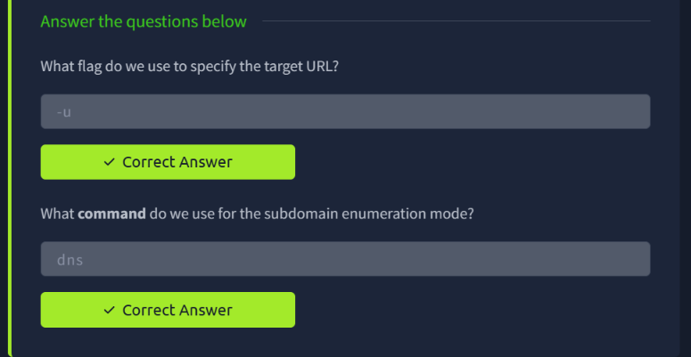
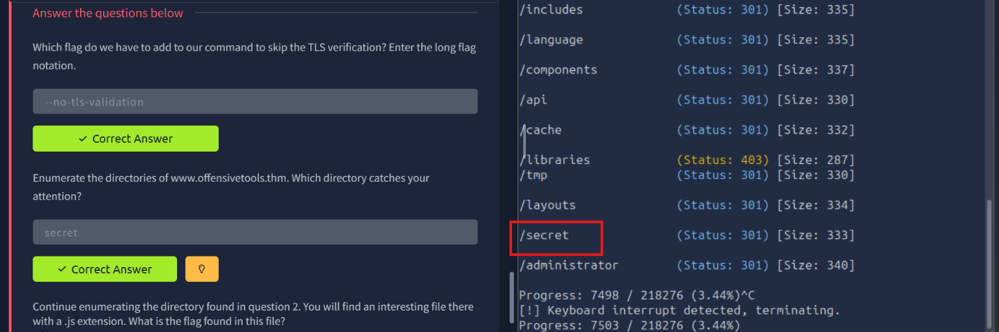
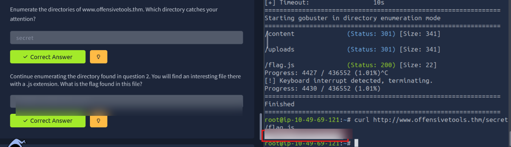
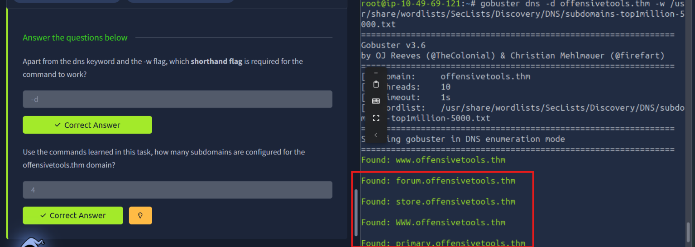
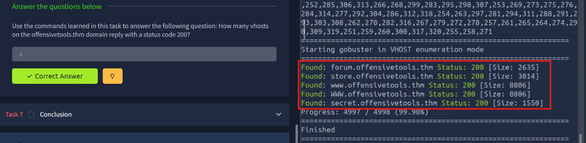

# TryHackMe — Gobuster: The Basics

> **Track:** Cyber Security 101 → Web Hacking
> **Difficulty:** Easy · **Time:** ~60 min
> **Focus:** Directory enumeration, DNS subdomain enumeration, and virtual host (vhost) enumeration with Gobuster


Gobuster is a fast brute-forcing tool that answers the question every recon phase starts with: *what's actually here that isn't linked anywhere?* This room covers its three core enumeration modes — directories, DNS subdomains, and vhosts — against a sample target, `offensivetools.thm`.

---

## Table of Contents
1. [Core Flags and Modes](#1-core-flags-and-modes)
2. [Handling TLS Verification](#2-handling-tls-verification)
3. [Directory Enumeration: Finding `/secret`](#3-directory-enumeration-finding-secret)
4. [Following Up: The Hidden Flag File](#4-following-up-the-hidden-flag-file)
5. [DNS Subdomain Enumeration](#5-dns-subdomain-enumeration)
6. [Virtual Host (VHOST) Enumeration](#6-virtual-host-vhost-enumeration)
7. [Key Takeaways](#7-key-takeaways)

---

## 1. Core Flags and Modes

Two fundamentals before running anything:

- **`-u`** specifies the target URL.
- Gobuster's subdomain enumeration mode is invoked with the **`dns`** command (`gobuster dns ...`), separate from its directory mode (`gobuster dir ...`) and vhost mode (`gobuster vhost ...`).



---

## 2. Handling TLS Verification

Test targets often use self-signed or invalid certificates. Gobuster's long-form flag to skip TLS verification is:

```bash
--no-tls-validation
```

This keeps requests going through even when the certificate chain can't be validated — necessary for lab environments, but worth remembering as a flag you'd never want to leave on against a real production target without good reason.

---

## 3. Directory Enumeration: Finding `/secret`

With TLS handling sorted, the first real enumeration run targets `www.offensivetools.thm`:

```bash
gobuster dir -u https://www.offensivetools.thm --no-tls-validation -w <wordlist>
```

Scanning through the results, most paths return `301` redirects (typical of directories), but one entry stands out from the noise: **`/secret`**.



---

## 4. Following Up: The Hidden Flag File

The task continues by enumerating inside `/secret`, where Gobuster turns up a `.js` file:

```bash
gobuster dir -u https://www.offensivetools.thm/secret --no-tls-validation -w <wordlist>
# ...
# /flag.js   (Status: 200) [Size: 22]
```

Pulling it directly confirms the find:

```bash
curl http://www.offensivetools.thm/secret/flag.js
```



> Flag redacted — the technique (enumerate → spot the odd file → `curl` it directly) is what matters.

**Why it matters:** this is the classic "forgotten file" pattern — a status file, debug endpoint, or backup script that was never meant to be reachable, sitting in a directory a scanner can find in seconds.

---

## 5. DNS Subdomain Enumeration

Switching to DNS mode to look for subdomains of `offensivetools.thm`:

```bash
gobuster dns -d offensivetools.thm -w /usr/share/wordlists/SecLists/Discovery/DNS/subdomains-top1million-5000.txt
```

Beyond `-d` (the domain) and `-w` (the wordlist), no other flag is required for the command to run. The scan turns up **4 configured subdomains**: `forum`, `store`, `www` (appearing in both cases), and `primary`.



---

## 6. Virtual Host (VHOST) Enumeration

DNS enumeration finds subdomains that resolve; **vhost enumeration** finds virtual hosts the web server itself responds to, which can differ from what DNS reports (useful when a server is configured to answer for names that aren't in public DNS at all).

```bash
gobuster vhost -u https://offensivetools.thm --no-tls-validation -w <wordlist>
```

Filtering for a `200` status code, **4 vhosts** respond successfully: `forum`, `store`, `www` (listed twice, differing in case), and **`secret`** — notably, `secret.offensivetools.thm` doesn't appear in the earlier DNS results at all, showing exactly why both enumeration modes matter.



---

## 7. Key Takeaways

- **Three distinct modes, three distinct answers**: `dir` finds paths, `dns` finds resolvable subdomains, `vhost` finds server-recognised hostnames. Relying on just one can miss real attack surface — `secret.offensivetools.thm` only showed up in vhost enumeration.
- **Odd-one-out entries matter.** In a sea of `301` redirects, the single differently-behaving path (`/secret`) was the one worth following.
- **Always chain your enumeration**: finding a directory is rarely the end — enumerating *inside* it found the flag file that a single top-level scan would have missed.
- `--no-tls-validation` is a lab convenience, not something to carry into assessments against hardened targets without justification.

---

*Room completed on 1 October 2026 as part of the Cyber Security 101 path.*
